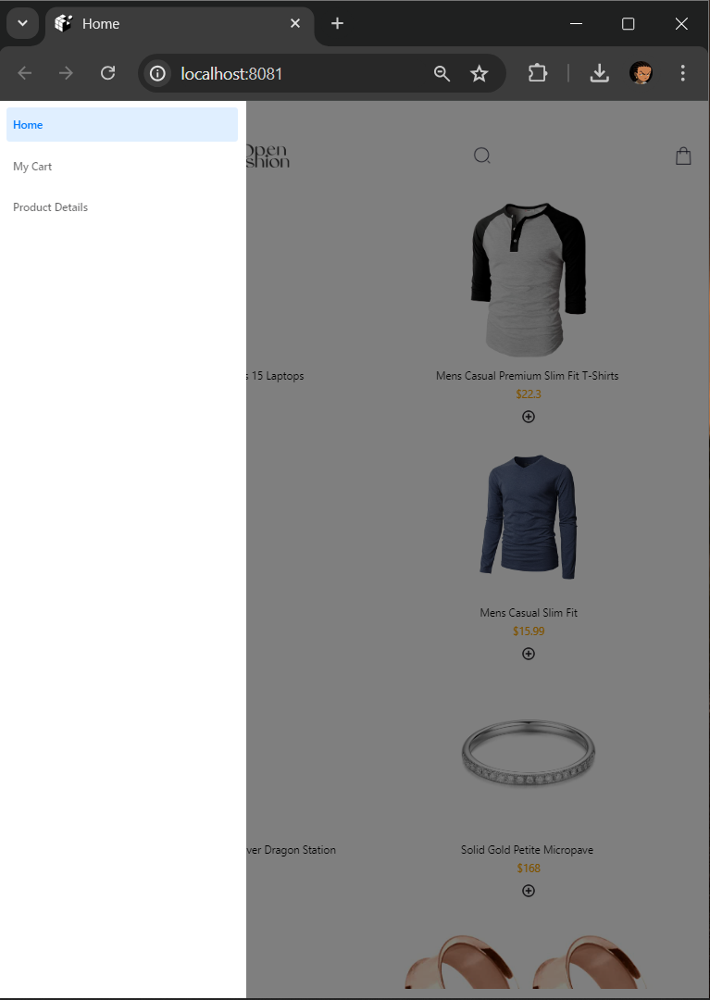
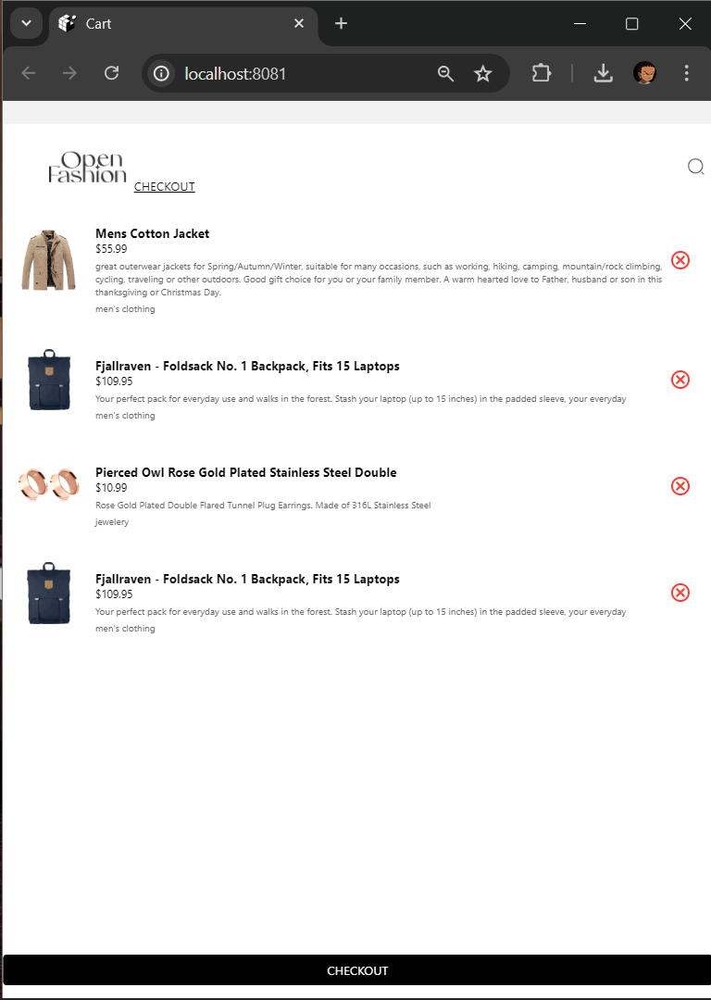

# E-Commerce React Native App

This is a React Native application for an e-commerce store, allowing users to browse products, view product details, add products to the cart, and proceed to checkout.

## Table of Contents

- [Features](#features)
- [Installation](#installation)
- [Usage](#usage)
- [Screenshots](#screenshots)
- [Contributing](#contributing)
- [License](#license)

## Features

- Browse a list of products
- View detailed information about each product
- Add products to the shopping cart
- Remove products from the shopping cart
- Checkout with a summary of the cart items

## Installation

1. **Clone the repository:**
    ```sh
    git clone  https://github.com/Edemowns/rn-assignment7-11052329.git
    cd  https://github.com/Edemowns/rn-assignment7-11052329.git
    ```

2. **Install dependencies:**
    ```sh
    npm install
    ```

3. **Run the app:**
    ```sh
    npm start
    ```

## Usage

1. **Home Screen**: Browse through the list of products.
2. **Product Detail Screen**: View detailed information about a selected product.
3. **Cart Screen**: View the products added to the cart and proceed to checkout.

## Screenshots

### Home Screen


### Drawer HomeScreen


### Product Detail Screen


### Cart Screen



 

## Contributing

1. Fork the repository
2. Create your feature branch (`git checkout -b feature/fooBar`)
3. Commit your changes (`git commit -am 'Add some fooBar'`)
4. Push to the branch (`git push origin feature/fooBar`)
5. Create a new Pull Request

